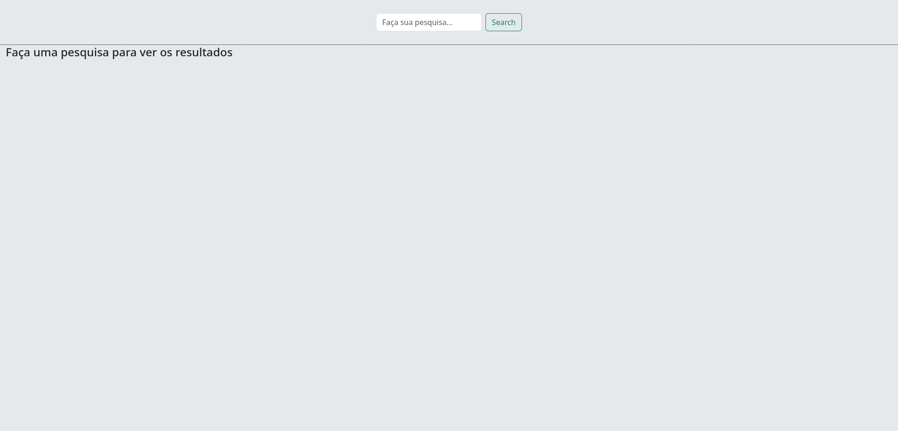
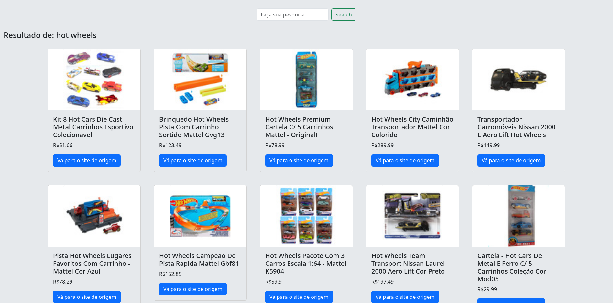

<h1 align="center">Minimalist Sales</h1>

Esse é um projeto pessoal criado por <a href="https://github.com/MrcsFranca">@MrcsFranca</a>

  <a href="#-tecnologias">Tecnologias</a>&nbsp;&nbsp;&nbsp;|&nbsp;&nbsp;&nbsp;
  <a href="#-projeto">Projeto</a>&nbsp;&nbsp;&nbsp;|&nbsp;&nbsp;&nbsp;
  <a href="#-minha">Minha experiência com o projeto</a>&nbsp;&nbsp;&nbsp;|&nbsp;&nbsp;&nbsp;
  <a href="#-licença">Licença</a>

  

	
	

## 🔥 Tecnologias

Esse projeto foi desenvolvido com as seguintes tecnologias:

  

## 💻 Projeto

Esse projeto foi criado como proposta de trabalho da aula de Projeto Introdutório em Computação da Unicentro no ano de 2024.

Idealizamos esse projeto com base na tendência do consumidor de comprar coisas que não precisam ao se deparar com anúncios desnecessários em site de vendas. Assim, evitando compras por impulso.

Para construir o projeto, eu e minha dupla:
1. Começamos construindo a interface em HTML, CSS e bootstrap
2. Estudamos sobre APIs e como o Javascript pode alterar o HTML
3. Usamos o DOM e a [API](https://github.com/Vitor-HenriqueP/projeto_Estacao_Digital) para criar a estrutura HTML de acordo com a pesquisa do usuário

## 🧠 Minha experiência com o projeto

- Aprendi a manipular o DOM
- Entendi sobre como APIs funcionam e como usa-las
- Aprendi sobre frameworks e principalmente bootstrap

- Pela primeira vez fiz um projeto em equipe
- Fazer um projeto em equipe me ensinou como passar informações sobre um projeto e atualizações do projeto de maneira exata

## 📝 Licença

Esse projeto está sob a licença MIT.